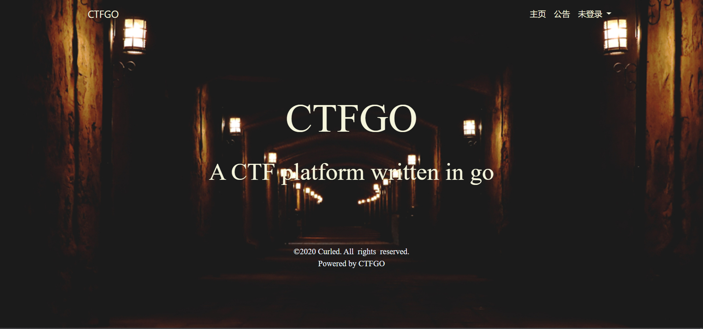

# CTFGO


## DESCRIPTION

CTFGO是一个基于golang编写的CTF比赛平台。



## HOW TO USE

### DOCKER

我们强烈建议您通过docker安装，只需要短短几行命令即可运行：

```bash
docker run -d -p 8080:8080 stegacrpto/ctfgo
```

或者：

```bash
git clone https://github.com/liupuchun/ctfgo.git
cd ctfgo
docker-compose up -d
```

### Windows平台

```bash
git clone https://github.com/liupuchun/ctfgo.git
cd ctfgo
go get -u github.com/beego/bee
bee run
```

如果提示sqlite安装失败，请安装[tdm-gcc](http://tdm-gcc.tdragon.net/download)或其他gcc环境。

### Linux平台

```bash
apt-get update
apt-get install gcc
git clone https://github.com/liupuchun/ctfgo.git
cd ctfgo
go get -u github.com/beego/bee
bee run
```

## TODO

- [x] 安装页面
- [x] 用户管理
- [x] 赛题管理
- [x] 比赛页面
- [ ] flag动态化防作弊
- [ ] 容器动态下发
- [ ] 好看的前端页面
- [ ] 初始化页面（首次加载时配置数据库等等）
